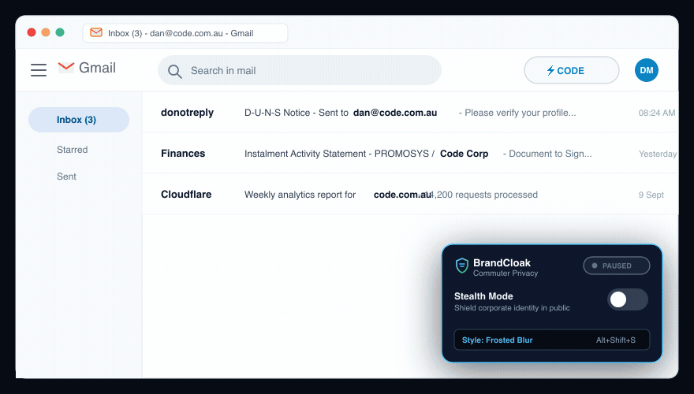

<p align="center">
  
</p>

<h1 align="center">BrandCloak</h1>

<p align="center">
  <strong>Stealth Commuter Privacy for Google Workspace & Atlassian Jira</strong><br />
  <em>Shield corporate identity, client names, and organization logos from shoulder surfers in public spaces.</em>
</p>

<p align="center">
  <a href="#installation"></a>
  
  
  
  
</p>

---

> [!NOTE]
> **Chrome Web Store Listing Coming Soon!**  
> BrandCloak is currently undergoing review for the Chrome Web Store. In the meantime, you can install and use it in seconds via **Developer Mode** below.

---

## 🎬 Demo

<p align="center">
  
</p>
<p align="center"><em>Toggle Stealth Mode on the fly with <kbd>Alt</kbd> + <kbd>Shift</kbd> + <kbd>S</kbd> to instantly obscure enterprise logos and nominated brand keywords.</em></p>

---

## 🛡️ Why BrandCloak?

When working on commuter trains, flights, cafes, or co-working spaces, casual onlookers and "shoulder surfers" can easily glance at your screen and identify your employer, company, or high-profile clients from ten feet away.

Enterprise SaaS tools routinely display:
- **High-contrast company logos** in the top navigation header.
- **Corporate tenant badges** (`Managed by yourcompany.com`) in account switchers.
- **Organization names and emails** in browser tab titles (visible to anyone walking behind you).
- **Client & company brand names** across email threads, subject lines, search results, and Jira ticket boards.

**BrandCloak** solves this by discreetly masking and transforming corporate identifiers into standard consumer SaaS appearances—letting you work productively in public with total peace of mind.

---

## ✨ Cloaking Modes

| Style | Appearance | Best For |
|---|---|---|
| **🛡️ Stock Logo (Recommended)** | Replaces custom company logos with authentic consumer SaaS icons (Multicolor Google "G" / Jira Compass). | **Maximum Discretion.** Glancing at your screen looks like normal personal Gmail/Jira—draws zero suspicion. |
| **🌫️ Frosted Blur** | Applies a soft, glassmorphic frosted blur over corporate logos, tenant badges, and nominated keywords. | **Visual Privacy.** Obscures sensitive names while preserving the structural layout of your workspace. |
| **👁️‍🗨️ Hidden** | Completely collapses the custom branding containers and tenant badges. | **Minimalist.** Eliminates enterprise branding blocks entirely. |

---

## 🚀 Key Features

- **Enterprise Logo Masking**: Replaces top-right Google Workspace corporate logos and Jira Cloud site titles with clean stock equivalents.
- **Nominated Brand Keyword Cloaking**: Specify custom brand keywords (e.g. `Acme`, `Contoso`, `InternalProject`) to automatically blur or hide them across email subjects, search results, body snippets, and Jira tickets.
- **Smart Boundary Matching**: Flexibly handles alphanumeric spacing and word variations (e.g. entering `acme` seamlessly covers `Acme`, `Acme Corp`, `acme-corp`, and `dan@acmecorp.com`).
- **Tab Title Sanitizer**: Dynamically strips organization names, corporate emails, and tenant tags from browser tabs (`Inbox (3) - dan@company.com - Gmail` $\rightarrow$ `Inbox (3) - Gmail`).
- **Account Switcher & Badge Protection**: Obscures enterprise `Managed by` badges and non-Gmail corporate addresses in account popups.
- **Instant Hotkey**: Press <kbd>Alt</kbd> + <kbd>Shift</kbd> + <kbd>S</kbd> (or <kbd>Option</kbd> + <kbd>Shift</kbd> + <kbd>S</kbd> on macOS) to toggle Stealth Mode instantly whenever someone sits down next to you.
- **Zero-Flicker Injection**: Declarative styling injected at `document_start` prevents logos from flashing during initial page load.

---

## 🌐 Supported Platforms

| Platform | Protected Surfaces |
|---|---|
| **Google Workspace** | Gmail, Google Drive, Google Docs, Google Sheets, Google Slides, Google Calendar, Google Meet, Google Chat, Google Admin Console, Google Accounts Switcher |
| **Atlassian Cloud** | Jira Software, Jira Service Management, Jira Work Management, Kanban & Scrum Boards, Backlogs, Navigation Header & Breadcrumbs |

---

## 📦 Installation

### Option 1: Chrome Web Store *(Coming Soon)*
The official Chrome Web Store package is currently in review. Once live, you will be able to install BrandCloak with a single click.

### Option 2: Install via Developer Mode (Manual)

1. **Clone or download this repository**:
   ```bash
   git clone https://github.com/Code4Au/brandcloak.git
   cd brandcloak
   ```
   *(Or click **Code $\rightarrow$ Download ZIP** on GitHub and extract it).*

2. **Open the Chrome Extensions manager**:
   - In Google Chrome, go to `chrome://extensions` (or open **Menu $\rightarrow$ Extensions $\rightarrow$ Manage Extensions**).

3. **Enable Developer Mode**:
   - Turn on the **Developer mode** toggle in the top-right corner.

4. **Load the extension**:
   - Click the **Load unpacked** button in the top-left corner.
   - Select the cloned `brandcloak` directory.

5. **Pin & Use**:
   - Click the puzzle icon in Chrome's toolbar and pin **BrandCloak**.
   - Click the BrandCloak shield icon to configure your cloaking style and nominated brand keywords.

---

## 🔒 Privacy & Security Guarantee

BrandCloak is built with a strict privacy-first philosophy:

- **100% On-Device**: All DOM manipulation, regex evaluation, and title sanitization happens purely inside your local browser tab.
- **Zero Remote Requests**: No data, telemetry, analytics, or browsing activity is ever logged, collected, or transmitted.
- **Minimal Permissions**: Uses only the `storage` permission to save your preferences locally. No tabs permission, no history access, and no remote code execution.

---

## 🧪 Interactive Testbed

To preview and verify all cloaking modes locally without needing to log in to corporate accounts:

1. Open [`test/testbed.html`](test/testbed.html) in your browser.
2. Toggle **Master Stealth**, switch between **Stock Logo**, **Frosted Blur**, and **Hidden** modes, or test custom brand keyword inputs in real time.

---

## 🛠️ Project Structure

```
brandcloak/
├── manifest.json              # Manifest V3 extension configuration
├── icons/                     # BrandCloak shield vectors & extension icons
│   ├── icon.svg               # Master vector asset
│   ├── icon-128.png           # Chrome Web Store & management icon
│   ├── icon-48.png            # Extensions card icon
│   ├── icon-32.png            # Retina toolbar icon
│   └── icon-16.png            # Standard toolbar favicon
├── popup/                     # Dark-mode extension popup UI
│   ├── popup.html
│   ├── popup.css
│   └── popup.js
├── content/                   # Content scripts & cloaking engines
│   ├── cloak-styles.css       # Zero-flicker CSS rules
│   ├── common-utils.js        # Shared SVG icons, regex caching, & title sanitizer
│   ├── cloak-google.js        # Google Workspace engine (Gmail, Drive, Docs)
│   └── cloak-jira.js          # Atlassian Jira Cloud engine
├── background/                # Service worker & hotkey management
│   └── service-worker.js
├── assets/                    # Public repository visual assets
│   └── demo.gif               # Animated showcase demonstration
└── test/                      # Local offline testbed & simulation suite
    ├── testbed.html
    ├── testbed.css
    └── testbed.js
```

---

## 🤝 Contributing

Contributions are always welcome! Whether you're reporting bugs, requesting support for additional SaaS platforms, or submitting code improvements, please read our [Contributing Guide](CONTRIBUTING.md) to get started.

---

## 📄 License

This project is licensed under the [MIT License](LICENSE).
